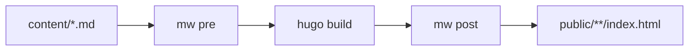

# Hugo

Hugo renders Markdown with Goldmark, not Python-Markdown, so the markwright extensions cannot run inside it.
Instead, the `mw` CLI brackets Hugo: the pre stage runs on your content before Hugo builds, and the post stage runs on Hugo's output HTML.
This is the same pre/render/post model described in the [Pipeline Guide](../pipeline.md), with Hugo as the renderer in the middle.

This page mirrors the project's own end-to-end integration test, so the configuration and commands below are exactly what is exercised in CI.

## How It Fits Together



The pre stage expands the embed directives and extracts the fence directives into `mw-fence` comments.
Hugo's Goldmark renderer turns the Markdown into HTML, passing the raw HTML and the comments through.
The post stage applies the fence labels and prefixes, resolves the in-code highlights, and injects the embed scripts.

## Prerequisites

- `markwright` installed, so the `mw` command is on your path. See the [CLI Reference](../cli.md).
- A Hugo site.

## Hugo Configuration

Two settings in `hugo.toml` are required. Without them Hugo silently strips what markwright produces, with no error.

```toml
[markup.goldmark.renderer]
  unsafe = true

[markup.highlight]
  noClasses = false
```

`unsafe = true` lets Goldmark pass raw HTML through, which the expanded embeds and the `mw-fence` comment depend on.
This is Goldmark's only way to preserve them; the default drops every raw-HTML node and the marker comment along with it.

`noClasses = false` makes Chroma, Hugo's syntax highlighter, emit CSS classes rather than inline styles.
The fence styling and the line prefixes hook onto those classes, so class-based highlighting is required.

See [Renderer Requirements](../renderer-requirements.md) for the full contract and what degrades if a requirement is unmet.

## Running the Pipeline

For a single page, run the pre stage on the source, build, then run the post stage on the rendered page:

```bash
mw pre  < content/posts/deploy.md > content/posts/deploy.md.tmp && mv content/posts/deploy.md.tmp content/posts/deploy.md
hugo
mw post < public/posts/deploy/index.html > public/posts/deploy/index.html.tmp && mv public/posts/deploy/index.html.tmp public/posts/deploy/index.html
```

The pre stage rewrites the content in place, Hugo builds it, and the post stage rewrites the rendered HTML in place.
Pass the same `--use` or `--exclude` flags to both stages if you want a subset of the extensions.

## Wrapping It in a Build Script

A real site applies the pre stage to every content file before the build and the post stage to every rendered page after it:

```bash
#!/usr/bin/env bash
set -euo pipefail

# Pre-process every Markdown file in place.
find content -name '*.md' -print0 | while IFS= read -r -d '' file; do
  mw pre < "$file" > "$file.tmp" && mv "$file.tmp" "$file"
done

hugo

# Post-process every rendered page in place.
find public -name '*.html' -print0 | while IFS= read -r -d '' file; do
  mw post < "$file" > "$file.tmp" && mv "$file.tmp" "$file"
done
```

Run this against a copy of `content/`, or commit only the original source, since the pre stage rewrites the files.
markwright special-cases nothing about Hugo: it is a pair of stdin-to-stdout filters, and Hugo is one renderer in the middle.

## What You Get

A source file looks like any other Markdown, with markwright syntax mixed in:

````markdown
[youtube dQw4w9WgXcQ]

A <^>highlighted<^> word.

```command
[label deploy.sh]
./deploy.sh --prod
```
````

After the full pipeline:

- `[youtube dQw4w9WgXcQ]` becomes a responsive iframe.
- The prose `<^>highlighted<^>` becomes `<mark>highlighted</mark>`.
- The command fence renders with its `deploy.sh` label and a `$` prompt on each line, and the `command` info string is highlighted as Bash.

The `mw-fence` comment that carried the fence directives is consumed by the post stage and does not appear in the final HTML.
