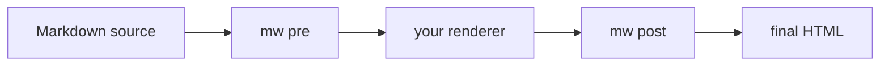

# Pipeline Guide

The `mw` CLI lets you use markwright syntax in a toolchain that is not built on Python-Markdown.
It brackets your existing renderer with two filters: a pre stage that runs on Markdown source, and a post stage that runs on the rendered HTML.
This page covers the model and shows worked Hugo and plain-Unix examples.

For the per-flag reference, see the [CLI Reference](cli.md).

## The Pre / Render / Post Model

Every markwright feature decomposes into at most two pure string transforms.
A source-stage transform takes Markdown text and returns Markdown with embedded HTML and marker comments.
An HTML-stage transform takes rendered HTML and returns rendered HTML.
Your renderer runs between them.



The pre stage expands the embed directives and extracts fence directives into an `mw-fence` comment.
Your renderer turns Markdown into HTML, passing the raw HTML and the comments through.
The post stage applies highlight, fence labels and prefixes, and one-time embed scripts.

## When to Run Only Post

You do not always need both stages.

Run **both stages** when your source contains pre-stage syntax: embed directives like `[youtube ID]`, or fence directives like `[label deploy.sh]`.
The pre stage has to expand those before your renderer sees them.

Run **only the post stage** when your HTML already carries the embed markup and any highlight markers, and you want the post-stage styling and script injection.
The post stage detects each embed's class signature on its own, so it injects scripts for hand-authored embeds with no pre-stage marker.
Highlight is also complete in the post stage: after a render, both prose and in-code markers surface as escaped text, and a single post pass handles both.

Run **only the pre stage** when you want prose highlights resolved to `<mark>` before your renderer runs, and nothing else.

The two stages are safe to combine.
Pre resolves prose highlights, post resolves whatever markers remain, and running post twice changes nothing.

## Plain Unix Example

The shortest path is a single pipe:

```bash
mw pre < in.md | cmark --unsafe | mw post > out.html
```

`cmark --unsafe` is [CommonMark](https://github.com/commonmark/cmark) with raw-HTML passthrough enabled, which the expanded embeds require.
To run a subset, pass matching flags to both stages:

```bash
mw pre --exclude twitter --exclude instagram < in.md \
  | cmark --unsafe \
  | mw post --exclude twitter --exclude instagram > out.html
```

If your source has no embed or fence directives and you only want highlight styling, the post stage alone is enough:

```bash
cmark --unsafe < in.md | mw post --use highlight > out.html
```

## Hugo Example

Hugo renders Markdown with Goldmark.
markwright sits outside Hugo: run the pre stage over your content before Hugo builds, and the post stage over Hugo's output.

Enable raw-HTML passthrough in Hugo so the expanded embeds and the `mw-fence` comment survive Goldmark.
In `hugo.toml`:

```toml
[markup.goldmark.renderer]
  unsafe = true
```

Pre-process a content file, build, then post-process the rendered page:

```bash
mw pre < content/posts/deploy.md > /tmp/deploy.md
mv /tmp/deploy.md content/posts/deploy.md
hugo
mw post < public/posts/deploy/index.html > /tmp/index.html
mv /tmp/index.html public/posts/deploy/index.html
```

A real site wraps this in a script that walks `content/` before the build and `public/` after it.
The tool special-cases nothing about Hugo: it is a pair of stdin-to-stdout filters, and Hugo is one renderer in the middle.

A source file that drives the full pipeline looks like any other Markdown, with markwright syntax mixed in:

````markdown
# Deploying the App

Watch the walkthrough first:

[youtube dQw4w9WgXcQ]

Then run the deploy script. Note the <^>--force<^> flag:

```command
[label deploy.sh]
ssh root@server
./deploy --force
```
````

After `mw pre`, the `[youtube ...]` line is an iframe, the fence carries an `mw-fence` comment, and the prose `<^>--force<^>` is wrapped in `<mark>`.
After Hugo renders and `mw post` runs, the fence shows its label and command prefix, and the in-code text is styled.
